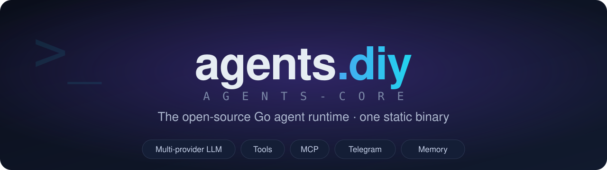
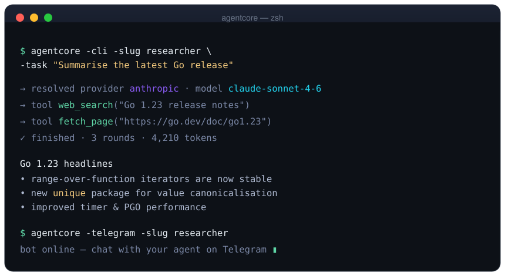
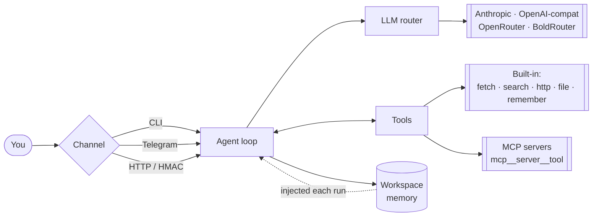

<p align="center">
  
</p>

<p align="center">
  <b>Ship an AI agent as a single binary.</b><br>
  Multi-provider LLMs · built-in tools · MCP · memory · Telegram — no PHP, no per-agent services, no fuss.
</p>

<p align="center">
  <a href="LICENSE.md"></a>
  
  
  
  
</p>

<p align="center">
  <a href="#-quickstart">Quickstart</a> ·
  <a href="#-features">Features</a> ·
  <a href="#-how-it-works">How it works</a> ·
  <a href="#-configuration">Configuration</a> ·
  <a href="#-roadmap">Roadmap</a>
</p>

---

## Why agents-core

Most agent frameworks hand you a pile of services to babysit. `agents-core` is the opposite: **one Go binary** that runs a complete agent — it calls the model, uses tools, connects to [MCP](https://modelcontextprotocol.io) servers, remembers what matters, and talks to users over Telegram or the CLI.

```diff
- runtimes, workers, a language VM, per-agent services, file-permission gymnastics
+ one static binary you can scp anywhere and run
```

It's the open-source core powering [**agents.diy**](https://agents.diy) — the same engine, in the open.

## ▶ See it run

<p align="center">
  
</p>

## ✨ Features

| | |
|---|---|
| 🧠 **Multi-provider LLM** | Anthropic + any OpenAI-compatible endpoint — Claude, GPT, MiniMax, OpenRouter, BoldRouter — auto-routed by API-key prefix. |
| 🔧 **Built-in tools** | `fetch_page`, `web_search`, `http_request`, `save_file` (workspace-sandboxed), `remember`. |
| 🔌 **MCP client** | Connect any Model Context Protocol server; its tools appear to the model as `mcp__<server>__<tool>`. |
| 💾 **Memory** | `remember` persists facts to the agent's workspace and re-injects them into the prompt every run. |
| 💬 **Telegram channel** | Chat with your agent over Telegram — long-poll, no public URL required. |
| ⌨️ **CLI mode** | Fire a one-off task and get the answer. Perfect for scripts and cron. |
| 🔐 **Encrypted keys** | Per-agent API keys are stored AES-256-GCM encrypted at rest. |
| 📦 **Single binary** | No PHP-FPM, no systemd-per-agent, no runtime deps. `go build` and go. |

## 🚀 Quickstart

**Install**

```bash
go install github.com/Cybrient-Technologies/agents-core/cmd/agentcore@latest
```

<sub>…or `git clone` + `go build ./cmd/agentcore`.</sub>

**Run a task (CLI)**

```bash
WORKSPACE_KEY=<64-hex> \
agentcore -cli -slug my-agent -task "Summarise the latest Go release notes"
```

**Put your agent on Telegram**

```bash
TELEGRAM_BOT_TOKEN=<token> \
WORKSPACE_KEY=<64-hex> \
agentcore -telegram -slug my-agent
```

**Serve it (HMAC-signed API)**

```bash
AGENTCORE_TOKEN=<shared-token> \
AGENTCORE_SIGNING_KEY=<hmac-key> \
WORKSPACE_KEY=<64-hex> \
agentcore
# → POST /api/status   POST /api/run
```

## 🧩 How it works



The loop is provider-neutral: the model asks for a tool, the runtime executes it, feeds the result back, and iterates until the agent produces a final answer.

## 🔧 Built-in tools

| Tool | What it does |
|---|---|
| `fetch_page` | Fetch a URL and return its readable text. |
| `web_search` | Search the web via Serper. |
| `http_request` | Make an authenticated API call. |
| `save_file` | Write a file inside the agent's sandboxed workspace. |
| `remember` | Save a durable fact for future runs. |

Plus every tool exposed by any connected **MCP** server.

## ⚙️ Configuration

| Variable | Purpose |
|---|---|
| `WORKSPACE_KEY` | 64-hex AES-256 key that decrypts stored agent API keys. |
| `WORKSPACES_DIR` | Where per-agent workspaces live (default `/opt/agentcore/workspaces`). |
| `AGENTCORE_TOKEN` | Shared bearer token for server mode. |
| `AGENTCORE_SIGNING_KEY` | HMAC-SHA256 signing key for server-mode requests. |
| `SERPER_API_KEY` | Enables `web_search`. |
| `TELEGRAM_BOT_TOKEN` | Enables the Telegram channel. |

An **agent** is a directory under `WORKSPACES_DIR/<slug>` with an `agent.json` (model, encrypted API key, tool policy, MCP servers) plus its working files.

## 🗺 Roadmap

- [x] Multi-provider tool-calling loop
- [x] Built-in tools + MCP client
- [x] Memory, Telegram channel, CLI
- [ ] Gemini tool-calling
- [ ] Scheduled / background runs
- [ ] More channels & tools

Ideas and issues welcome — see below.

## 🤝 Contributing

Issues and PRs are welcome. Please open an issue to discuss anything substantial before a large PR.

```bash
go build ./...   # build everything
go test ./...    # run the suite
go vet ./...     # static checks
```

## 📄 License

[**FSL-1.1-ALv2**](LICENSE.md) — the Functional Source License. Use, modify, and redistribute freely for any purpose **except** building a competing product; each release automatically converts to **Apache 2.0** two years after publication.

<sub>© 2026 Cybrient Technologies SA · built with ❤️ for the <a href="https://agents.diy">agents.diy</a> community</sub>
